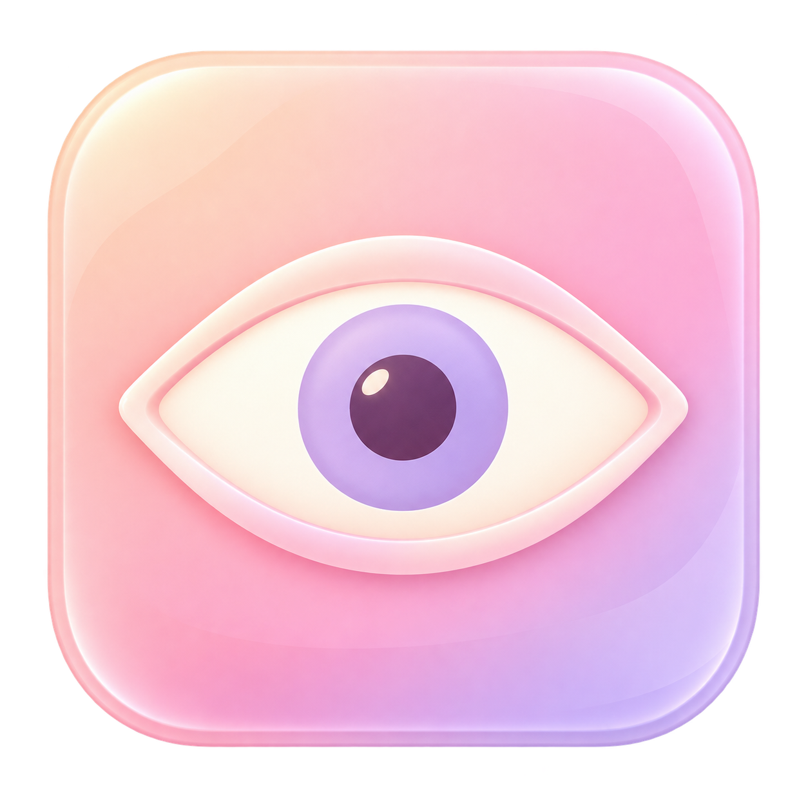
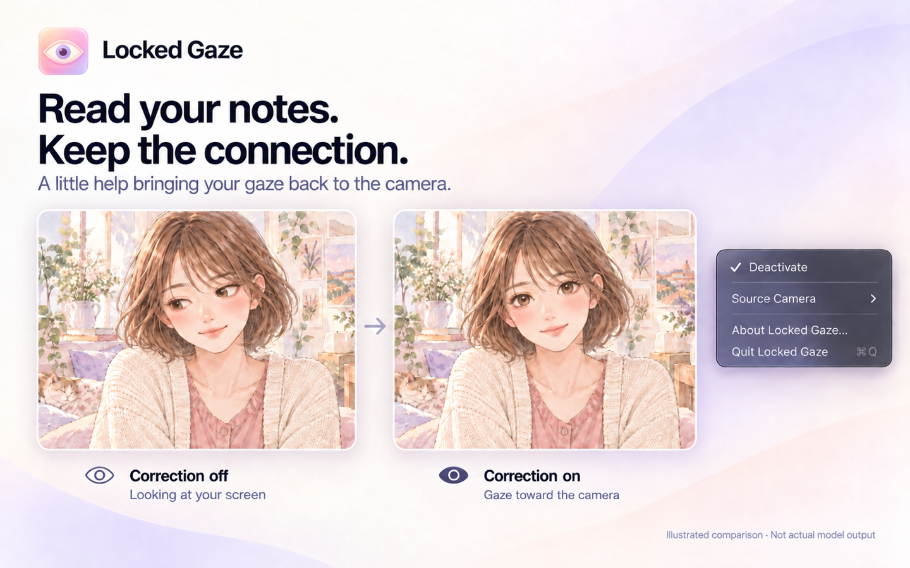
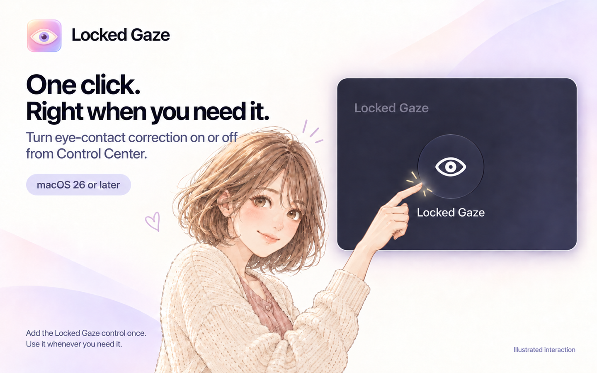

<p align="center">
  
</p>

<h1 align="center">Locked Gaze</h1>
<p align="center"><strong>Keep your eyes on the conversation.</strong><br>Eye-contact correction for your Mac. Private by design.</p>

<p align="center">
  <a href="LICENSE"></a>
  <a href="#coming-to-mac"></a>
  <a href="#coming-to-mac"></a>
  <a href="https://developer.apple.com/documentation/swiftui"></a>
  <a href="#coming-to-mac"></a>
</p>

<p align="center">
  <a href="#your-conversation-your-mac"></a>
  <a href="#your-conversation-your-mac"></a>
  <a href="#your-conversation-your-mac"></a>
  <a href="https://github.com/albond/locked-gaze/stargazers"></a>
  <a href="#support-the-project"></a>
</p>

<p align="center">
  <a href="#a-small-app-with-a-clear-purpose">Features</a> · <a href="#your-conversation-your-mac">Privacy</a> · <a href="#three-simple-steps">How it works</a> · <a href="#coming-to-mac">Availability</a> · <a href="https://github.com/albond/locked-gaze">Star on GitHub</a> · <a href="#support-the-project">Donate</a>
</p>

Reading notes, following a presentation, or watching the person on screen can pull your gaze away from the camera. Locked Gaze helps bring it back, so you can focus on what you want to say.

*Illustrated product previews. The manga artwork is sample imagery, not a processed camera frame or an avatar feature.*



## Your conversation, your Mac

Your camera frames stay on your Mac. Eye-contact correction runs entirely on your device, without uploading video for processing. Locked Gaze does not record your camera feed.


## A small app with a clear purpose

- **Eye contact, with less effort.** Gaze correction designed for conversations, presentations, and interviews.
- **A home in your menu bar.** Turn correction on when you need it and off when you are done.
- **One click from Control Center.** On macOS 26 or later, add the Eye Contact control to turn correction on or off.
- **Your choice of camera.** Select a webcam or use your iPhone through Continuity Camera.
- **A camera you can select.** Choose **Locked Gaze** in video apps that support macOS virtual cameras.
- **Made for Apple Silicon.** Local processing built around your Mac.

## Three simple steps

After granting camera access and enabling the camera extension:

1. Choose your source camera in Locked Gaze.
2. Click **Activate** in the menu bar.
3. Select **Locked Gaze** as the camera in your video app.

Click **Deactivate** whenever you want to stop processing.

## One click from Control Center

On **macOS 26 or later**, add the **Locked Gaze** control to Control Center. After the initial camera setup, click it whenever you want to turn eye-contact correction on or off. You can also keep using the menu-bar control.



## Coming to Mac

Locked Gaze **1.0.0** is being prepared for a **free Mac App Store release**. It is not available to download yet.

[Follow Locked Gaze on GitHub](https://github.com/albond/locked-gaze) and give it a star to bookmark the project. The source edition includes the native application and model interface specifications. Model weights are not included; building a working gaze-correction app requires compatible models supplied separately.

Designed for **macOS 14 Sonoma or later**, with **M2 Pro / Max / Ultra or a newer Pro / Max / Ultra chip**. Compatibility testing is ongoing ahead of release.

## Support the project

Locked Gaze is being built for a free release, with no subscriptions or hidden payments. If you like the idea, [give the project a star](https://github.com/albond/locked-gaze) or leave an optional tip to support development. Donations do not unlock features; the app is designed to be complete for everyone.

### Tip jar

Support Locked Gaze with an optional donation:

```text
0xF734F20bFeB7ddb3f0519ADAfbBa056939c9C261
```

| Network | Accepted tokens |
| --- | --- |
| Polygon | USDC · USDT |
| Ethereum mainnet | USDC · USDT · EURC |

Choose one of these networks in your wallet and verify the recipient address before sending. Network fees are separate from the donation.

Thank you for helping keep Locked Gaze simple, private, and free.

## Project information

Original application source code and documentation are licensed under [MIT](LICENSE). Model weights and separately licensed third-party components are outside that grant; see [third-party notices](THIRD_PARTY_NOTICES.md).

[Model interfaces](Models/README.md) · [Privacy policy](PRIVACY.md) · [Security](SECURITY.md) · [Contributing](CONTRIBUTING.md) · [Code of conduct](CODE_OF_CONDUCT.md)
